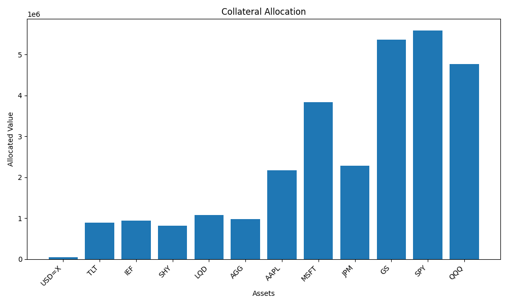

# Collateral Optimization for Margin Calls

This project implements a collateral optimization model designed to help financial institutions efficiently allocate their assets to meet margin calls. By using linear programming, this tool minimizes haircut losses while adhering to various diversification constraints.

## Features

* **Optimal Asset Allocation:** Utilizes `scipy.optimize.linprog` to determine the most efficient allocation of collateral assets to meet margin call requirements.
* **Haircut Loss Minimization:** The optimization process prioritizes minimizing losses due to asset haircuts.
* **Diversification Constraints:** Incorporates constraints to ensure a diversified portfolio, including:
    * Maximum allocation per asset.
    * Minimum allocation per asset.
    * Minimum number of assets used.
* **Real-time Market Data (Optional):** Integrates with `yfinance` to fetch real-time market data (note: reliability may vary).
* **Data Persistence:** Saves optimization results to CSV and JSON files for easy access and analysis.
* **Visualizations:** Generates clear bar charts using `matplotlib` to visualize the allocation of assets.
* **Asset Management:** Uses a `CollateralAsset` class to easily define and manage asset attributes like market value, haircut, and eligibility.

## Getting Started

### Prerequisites

* Python 3.6+
* `pip` (Python package installer)


### Usage

1.  **Run the main script:**

    ```bash
    python main.py
    ```


2.  **Enter the margin call amount when prompted.**
$200000
3.  **The script will:**

    * Fetch market data (if `yfinance` is enabled).
    * Optimize the collateral allocation.
    * Save the results to `collateral_data.csv` and `collateral_data.json`.
    * Display a bar chart of the allocation.

### Example Output

Here is an example of the visualization that the script will create.



The graph above, "Collateral Allocation," visualizes the optimized allocation of assets to meet a specified margin call. The results demonstrate the application of linear programming with diversification constraints to achieve an efficient and balanced collateral portfolio.

Diversified Allocation: The graph clearly shows that the allocation is spread across a variety of assets, including cash ("USD=X"), government bonds (TLT, IEF, SHY), corporate bonds (LQD, AGG), and equities (AAPL, MSFT, JPM, GS, SPY, QQQ). This indicates that the diversification constraints implemented in the CollateralOptimizer.optimize method are effectively working.

Equities Dominance: A significant portion of the allocation is concentrated in equity assets (GS, SPY, QQQ). This could be attributed to several factors:
These assets might have higher market values or better eligibility compared to others.
The optimization algorithm, while considering haircuts, might find equities more efficient in meeting the margin call.
The constraints may have allowed for higher allocations into these assets.

Constraint Impact: The distribution of assets reflects the impact of the minimum and maximum allocation constraints. These constraints ensure that no single asset dominates the portfolio and that a minimum number of assets are used, leading to a more robust allocation.

Real-World Considerations: It's important to note that if the yfinance data retrieval had failed, random data would have been used. Therefore the results could be based on real market data, or randomly generated data.

## Code Structure

* `your_script_name.py`: Main script containing the `CollateralAsset` and `CollateralOptimizer` classes, data fetching, and execution logic.
* `requirements.txt`: List of Python dependencies.
* `collateral_data.csv`: Output file containing allocation data in CSV format.
* `collateral_data.json`: Output file containing allocation data in JSON format.

## Important Notes

* **yfinance Reliability:** The `yfinance` library is used for fetching market data. Please be aware that it relies on unofficial APIs and may not always be reliable. For production use, consider a more stable data source.
* **Randomized Data (Fallback):** If `yfinance` data retrieval fails, the script falls back to using randomized market values. This is for testing purposes only.
* **Haircuts and Eligibility:** The haircuts and eligibility criteria used in this example are simplified. Real-world applications require accurate and up-to-date data.
* **Constraints:** The diversification constraints can be adjusted in the `CollateralOptimizer.optimize` method to suit specific requirements.

